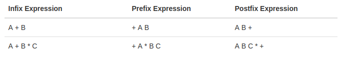

<table class="hide" width="100%" style='table-layout:fixed;'>
  <tr>
    <td>
      <a href="https://airtable.com/shrSzEYT4idEFGB8d?prefill_clase=02-JS-I">
        
        <br>
        Haz click acá para dejar tu feedback sobre esta clase.
      </a>
    </td>
  </tr>
</table>

# JavaScript I

#### Introducción a JavaScript

En esta lección cubriremos:

* Introducción a Javascript
* Variables
* Tipos de datos
* Operadores

## Introducción a Javascript

JavaScript es un lenguaje de programación que fue creado originalmente para ser usado en el front-end de una pǻgina web. La idea original era poder dar dinamismo a las páginas webs, que en un principio eran estáticas. La introducción del "motor V8" de Google ha mejorado la velocidad y el funcionamiento de JS. Haciendo que JS (javascript) sea la lengua franca de la web, llegando inclusive al Back-End a través de NodeJS.

Vamos a aprender los conceptos más básicos de JS:


## Variables

Una variable es una forma de almacenar el valor de algo para usar más tarde. (Una nota para aquellos con conocimientos previos de programación: Javascript es un lenguaje de tipado dinámico, una variable se puede configurar (y restablecer) a cualquier tipo, no necesitamos declarar su tipo al iniciar la variable).

Para crear una variable en JavaScript utilizamos la palabra clave `var`, seguida de un espacio y el nombre de la variable (con este nombre, llamado **identificador**, podremos hacer referencia a ella luego). Además de declarar una variable, podemos asignarle un valor usando el signo `=`. Los identificadores pueden iniciar con una letra, un guión bajo (_) o signo pesos ($), además de que puede contener también números. Los siguientes son nombres válidos de variables: `Nombre_usuario`, `Email002`, `$ahorros` y `_direccion`. También, JS distingue entre mayúsculas y minúsculas para nombrar variables, así que `Nombre` y `nombre` serían dos nombres de variables **DIFERENTES**.

> Nota: Las palabras claves o keywords son palabras especiales que utiliza el lenguaje para indicar algo. No podremos usar las palabras claves del lenguaje como nombres de variables.

Existen tres formas de declarar una variable:

```javascript
    var nombre = 'Juan'; // Vamos a usar principalemente esta forma
    let apellido = 'Perez';
    const comidafavorita = 'Pizza';
```

### var

`var` es la forma de declarar una variable en ES5 (ES5 es la versión de JS, hoy en día existe ES6 que es la nueva versión, pero que todavía no es la más usada). Esta es una _palabra clave_ genérica para "variable".

Las siguentes dos formas son válidas también, pero vamos a utilizarlas más adelante en la carrera, cuando tengamos más claros otros conceptos:

### let

`let` es una nueva palabra clave de ES6, esto asignará una variable muy similar a `var`, pero con un comportamiento un poco diferente. Lo más notable es que difiere al crear un "nivel de _scope_" (hablaremos sobre esto más adelante).

### const

`const` también es nuevo en ES6. Un `const` es una variable que no se podrá cambiar. Esto es la abreviatura de "constante".

### console.log

Otro concepto del que hablaremos de inmediato es

```javascript
console.log();
```

Este método muy simple nos permitirá imprimir en la consola todo lo que pongamos entre paréntesis.


## Tipos de Datos

En ciencias de la computación, un tipo de dato informático o simplemente tipo, es un atributo de los datos que indica la clase de datos que se va a manejar. Esto incluye imponer restricciones en los datos, como qué valores pueden tomar y qué operaciones se pueden realizar con estos.

Los tipos de datos aceptados varían de lenguaje en lenguaje.

Los tipos de datos más básicos en Javascript son ***Strings***, ***Numbers*** y ***Booleans***.

### Strings

Las "strings" son bloques de texto los cuales siempre se definirán entre comillas, ya sean simples (`''`) o dobles (`""`). Cualquier texto entre comillas es una cadena o string.

```javascript
var nombrePerro = 'firulais';
```

### Numbers

Los números son solo eso, números. Los números **NO** se envuelven en comillas. Pueden ser negativos o positivos. Javascript tiene una limitación en el tamaño de un número (+/- 9007199254740991), pero muy raramente aparecerá esa limitación en nuestro uso diario.

```javascript
var positivo = 27;
var negativo = -40;
var decimal = 25.785;
```

### Boolean

Los booleanos provienen de la [lógica de Boole](https://es.wikipedia.org/wiki/%C3%81lgebra_de_Boole). Es un concepto que alimenta el código binario y el núcleo de las computadoras. Es posible que hayas visto código binario en el pasado (0001 0110…), esto es lógica booleana. Esencialmente significa que tiene dos opciones, activar o desactivar, 0 o 1, verdadero o falso. En Javascript usamos booleanos para significar verdadero o falso. Esto puede parecer simple al principio, pero puede complicarse más adelante.

```javascript
var meEncantaJavascript = true;
var noSoyBuenProgramador = false;
```

Los valores posibles de un dato booleando en JS son: `true` o `false`.

Podemos encontrar también los tipos `undefined` y `null`.

### Undefined

Obtendrás `undefined` cuando busques _algo_ que no existe, como una variable que aún no tiene un valor. `undefined` simplemente significa que lo que estás pidiendo no existe.

```javascript
console.log(variableInexistente); // undefined
```

### Null

`null` se usa para establecer que el elemento que están buscando existe, pero no hay ningún valor asociado a este. 

```javascript
var numeroTelefono = '11-1234-5678';
numeroTelefono = null;

numeroTelefono; // null
```
Mientras que `undefined` está configurado por Javascript,` null` está configurado por un desarrollador. Si alguna vez recibes `null`, debes saber que otro desarrollador estableció ese valor en` null`.

Una última cosa a tener en cuenta, ni `undefined` ni` null` son cadenas, están escritas tal como están sin comillas, como un booleano.


## Operadores

Vamos a poder realizar operaciones en JavaScript a través de los `operadores`. Básicamente son símbolos que ya conocemos (`+`, `-`, `/`, `*`) que indican al intérprete de JavaScript las operaciones que debe realizar.

Por ejemplo: Para el intérprete al ver el signo `+`, sabe que tiene que ejecutar la función suma (que tiene internamente definida), y toma como parámetros los términos que estén a la izquierda y la derecha del operador.

```javascript
var a = 2 + 3; // 5
var b = 3 / 3; // 1
```

De hecho, esa forma de escribir tiene un nombre particular, se llama notación `infix` o `infija`, en ella se escribe el operador entre los operandos. Pero también existen otro tipos de notación como la `postfix` o `postfija` y la `prefix` o `prefija`. En estas últimas el operador va a la derecha de los operandos o a la izquierda respectivamente.



En fin, lo importante a tener en cuenta es que los operadores _son_ funciones.

Tenemos entonces los operadores matemáticos de siempre

### + - * / =

```javascript
1 + 1 = 2
2 * 2 = 4
2 - 2 = 0
2 / 2 = 1
```
y un operador nuevo que será de gran ayuda: el operador módulo.

### Módulo (%)

Este dividirá los dos números entre los que se encuentra y devolverá el resto o residuo de la división. Por ejemplo:

```javascript
21 % 5 = 1;
21 % 6 = 3;
21 % 7 = 0;
```

### Precedencia de Operadores y Asociatividad

Esto parece aburrido, pero nos va a ayudar a saber cómo piensa el intérprete y bajo qué reglas actúa.

La _precedencia de operadores_ es básicamente el orden en que se van a llamar las funciones de los operadores. Estas funciones son llamadas en _orden de precedencia_ (las que tienen __mayor__ precedencia se ejecutan primero).  O sea que si tenemos más de un operador, el intérprete va a llamar al operador de mayor precendencia primero y después va a seguir con los demás.

La _Asociatividad de operadores_ es el orden en el que se ejecutan los operadores cuando tienen la misma precedencia, es decir, de izquierda a derecha o de derecha a izquierda.

> Podemos ver la documentación completa sobre Precedencia y Asociatividad de los operadores de JavaScript [acá](https://developer.mozilla.org/en/docs/Web/JavaScript/Reference/Operators/Operator_Precedence#Table)

Por ejemplo: `console.log( 3 + 4 * 5)` Para resolver esa expresión y saber qué resultado nos va a mostrar el intérprete deberíamos conocer en qué orden ejecuta las operaciones. Al ver la tabla del link de arriba, vemos que la multiplicación tiene una precedencia de 14, y la suma de 13. Por lo tanto el intérprete primero va a ejecutar la multiplicación y luego la suma con el resultado de lo anterior -> `console.log( 3 + 20 )` -> `console.log(23)`.

> Cuando invocamos una función en Javascript, los argumentos son evaluados primeros (se conoce como [__non-lazy__ evaluation]()), está definido en la [especificación](http://es5.github.io/#x11.2.3).
> No confundir el orden de ejecución con asociatividad y precedencia, [ver esta pregunta de StackOverflow](http://stackoverflow.com/questions/13849906/operator-precedence-and-associativity-with-math-floormath-random).

Ahora si tuvieramos la misma precedencia entraría en juego la asociatividad, veamos un ejemplo:

```javascript
var a = 1, b = 2, c = 3;

a = b = c;

console.log(a, b, c);
```

¿Qué veriamos en el console.log? Para eso tenemos que revisar la tabla por la asociatividad del operador de asignación `=`. Este tiene una precedencia de 3 y una asociatividad de `right-to-left`, es decir que las operaciones se realizan primero de derecha a izquierda. En este caso, primero se realiza `b = c` y luego `a = b` (en realidad al resultado de `b = c`, que retorna el valor que se está asignando). Por lo tanto al final de todo, todas las variables van a tener el valor `3`. Si la asociatividad hubiese sido al revés, todos las variables tendrían el valor `1`.

### Operadores de comparación

Se usan para comparar dos expresiones y devuelven un valor booleano, `true` o `false`, que representa la relación entre estas dos expresiones. Los operadores de comparación son:

- \==   ( igual a... )
- \!=   ( diferente a... )
- \===  ( igual a... Compara también el tipo de dato )
- \!==  ( diferente a... Compara también el tipo de dato )
- \>=   ( mayor o igual que... )
- \<=   ( menor o igual que... )
- \>    ( mayor (estricto) que... )
- \<    ( menor (estricto) que... )

El "triple igual" (`===`) no debe confundirse con un solo signo igual (que indica asignar un valor a una variable). El triple igual comparará todo sobre los dos elementos, incluido el tipo, y devolverá si son exactamente iguales o no.

(Algo a tener en cuenta: hay un "doble igual" (`==`) que comparará dos elementos, pero NO tendrá en cuenta sus tipos (`1 == '1' // verdadero`) Debido a esto, se considera una mala práctica usar el doble igual. Nos gustaría verte siempre usando el triple, y siempre nos verás usándolo)

El "NOT" (`!`) pregunta lo contrario de la expresión (volveremos a visitar el operador NOT más adelante en esta lección)

Con eso en mente, podemos introducir el "no es igual" (`!==`). Esto devolverá verdadero si los artículos **NO** son iguales entre sí de alguna manera. Esto, como el triple igual, tiene en cuenta el tipo de dato.


Por ejemplo:

```javascript
3 === 3 // true
3 == '3' // true
3 === '3' // false
3 !== '3' // true

4 != 3 // true
3 >= '3' // true
3 <= 4 // true
3 > '3' // false
4 < '3' // false
```

### Operadores lógicos

También podemos combinar dos expresiones de igualdad y preguntar si alguna de las dos es verdadera, si ambas son verdaderas o si ninguna de ellas es verdadera. Para hacer esto, utilizaremos operadores lógicos.

### &&
El primer operador lógico que veremos es el operador "Y" ("AND"). Está escrito con dos símbolos (``&&``). Esto evaluará ambas expresiones y devolverá true si y solamente si **AMBAS** expresiones son true. Si una de ellas (o ambas) son false, este operador devolverá false:

```javascript
(100 > 10) && (10 === 10) // true
(10 === 9) && (10 > 9) // false
```

### | |

El siguiente es el operador "Ó" ("OR"). Está escrito con dos barras verticales (``||``). Devolverá true si al menos una de ellas (o ambas) son true. Devolverá false si **AMBAS** expresiones son false:

```javascript
(100 > 10) || (10 === 10) // true
(100 < 10) || (10 === 10) // true
(100 > 10) || (10 !== 10) // true
(10 === 9) || (10 < 9) // false
```
### !

El último operador lógico es el operador "NOT" ("NO"). Está escrito como un solo signo de exclamación (``!``). Vimos este operador antes al determinar la igualdad (!==). Como antes, el operador NOT devolverá el valor booleano opuesto de lo que se le pasa:

```javascript
!false // true
!(1 === 1) // false
```

### Notas sobre operadores lógicos

Un par de cosas a tener en cuenta sobre los operadores lógicos.

- Las expresiones se evalúan en orden y la computadora omitirá cualquier expresión redundante. En una declaración &&, si la primera expresión es false, la segunda expresión no se evaluará porque AMBAS expresiones deben ser true. Lo mismo para la declaración ||. Si la primera expresión es verdadero, la segunda no se evaluará porque solo debe haber una declaración verdadero para cumplir con los requisitos del operador.

- Usa paréntesis. Como vimos en el segundo ejemplo de operador !, usamos paréntesis para evaluar PRIMERO lo que estaba dentro de los paréntesis, luego aplicamos el operador !. Podemos ajustar cualquier expresión entre paréntesis y se evaluará antes de evaluar la expresión como un todo.


## Métodos

Algunos tipos de datos tienen métodos incorporados, los cuales realizan una acción en concreto **SOLO** para este tipo de dato. Uno de los más comunes es el método **.length** definido para el tipo de dato "string" y lo que hace es devolver la cantidad de caracteres que tiene una cadena en particular. Por ejemplo:

```javascript
var nombreGato = 'felix';
console.log(nombreGato.length); // 5
```

Veremos muchos otros métodos integrados en otros tipos de datos a lo largo de este curso.


## Homework

Completa la tarea descrita en el archivo `README` dentro de la carpeta homework.

## Recursos adicionales

* [MDN: Comparison Operators](https://developer.mozilla.org/en-US/docs/Web/JavaScript/Reference/Operators/Comparison_Operators)
* [Codecademy: Learn Javascript](https://www.codecademy.com/learn/learn-javascript)
* [Udacity: Intro to Javascript](https://www.udacity.com/course/intro-to-javascript--ud803)
* [MDN: Official Javascript Documentation](https://developer.mozilla.org/en-US/docs/Web/JavaScript)