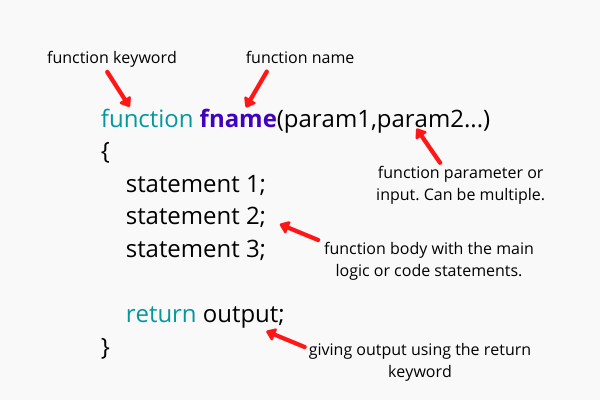

<table class="hide" width="100%" style='table-layout:fixed;'>
  <tr>
    <td>
      <a href="https://airtable.com/shrSzEYT4idEFGB8d?prefill_clase=03-JS-II">
        
        <br>
        Haz click acá para dejar tu feedback sobre esta clase.
      </a>
    </td>
  </tr>
</table>

# JavaScript II

En esta lección cubriremos:

* Funciones (argumentos, `return`)
* Controladores de flujo (`if` / `else`)

## Introducción a las funciones


Las funciones son una parte muy importante de todo lenguaje de programacion y sobre todo en JavaScript. Son tipos particulares de objetos, llamados ***callable objects*** u objetos invocables, por lo que tienen las mismas propiedades que cualquier objeto.

Ahora que tenemos un conjunto de variables, necesitamos funciones para calcularlas, cambiarlas, hacer algo con ellas. Hay tres formas en que podemos construir una función:

```javascript
function miFuncion() {}
var otraFuncion = function () {};
var yOtra = () => {};
```
Usaremos la primera forma en esta lección y hablaremos sobre las otras formas en próximas lecciones.

### Anatomía de una Función


```javascript
function miFuncion() {}
```

Una función comenzará con la palabra clave `function`, esto le dice a lo que sea que esté ejecutando tu programa que lo que sigue es una función y que debe tratarse como tal. Después de eso viene el nombre de la función, nos gusta dar nombres de funciones que describan lo que hacen. Luego viene un paréntesis abierto y uno cerrado. Finalmente, abrimos y cerramos las llaves. Dentro de estas es donde estará todo nuestro código a ejecutar, al hacer el llamado de la función.

```javascript
function logHola() {
    console.log('hola!');
}

logHola();
```
En este ejemplo declaramos una función `logHola` y la configuramos en `console.log('hola')`. Entonces podemos ver que para ejecutar esta función, necesitamos escribir el nombre y los paréntesis. Esta es la sintaxis para ejecutar una función. Una función siempre necesita paréntesis para ejecutarse.

### Argumentos

Ahora que podemos ejecutar una función básica, vamos a comenzar a pasarle argumentos.

```javascript
function logHola(nombre) {
    console.log('Hola, ' + nombre);
}

logHola('Martin');
```
Si agregamos una variable a los paréntesis cuando declaramos la función, podemos usar esta variable dentro de nuestra función. Iniciamos el valor de esta variable pasándola a la función cuando la llamamos. En este ejemplo, `nombre = 'Martin'` al momento de llamar la función con el argumento ``Martin``. También podemos pasar otras variables de esta manera:

```javascript
function logHola(nombre) {
    console.log( `Hola, ${nombre}`);
}

var miNombre = 'Antonio';
logHola(miNombre);
```
Podemos agregar múltiples argumentos colocando una coma entre ellos:

```javascript
function sumarDosNumeros(a, b) {
  var suma = a + b;
  return suma;
}

sumarDosNumeros(2, 6); // 8
```
### Declaración "return"

En el ejemplo anterior presentamos la declaración `return`. No vamos a usar `console.log` con todo lo que salga de una función. Lo más probable es que queramos devolver algo. En este caso es la suma de los dos números. Piense en la declaración de retorno ("return") como la única forma en que los datos escapan de una función. No se puede acceder a nada más que a lo que se devuelve fuera de la función. También tenga en cuenta que cuando una función golpea una declaración de retorno, la función detiene inmediatamente lo que está haciendo y "devuelve" lo especificado.

Si intentamos hacer `console.log` a algo que declaramos dentro de la función, devolverá `undefined` porque no tenemos acceso a este fuera de la función.

La única forma de acceder a algo dentro de la función es devolverlo.

También podemos establecer variables para igualar a lo que devuelve una función.

```javascript
function restarDosNumeros(a, b) {
  var diferencia = a - b;
  return diferencia;
}

var diferenciaDeResta = restarDosNumeros(10, 9);
console.log(diferenciaDeResta); // 1
console.log(diferencia); // undefined
```
Podemos ver que la variable `diferencia` se establece dentro de la función y solo pertenece allí.

---
## Controladores de flujo (`if` / `else`)

Se refiere al orden en que es ejecutado nuestro código en JavaScript. Nuestro código normalmente se ejecuta de arriba a abajo, desde nuestra primera línea hasta la última, sin embargo, esto puede cambiar a medida los controladores de flujo son implementados en nuestro script. Estos pueden hacer que parte de nuestro código no sea leído o sea leído de una forma diferente, etc.

Dentro de estos casos, encontramos los ``condicionales``, los cuales y como lo dice su nombre, ejecutarán código en particular a partir de que ciertas condiciones específicas se satisfagan o no.
### Condicionales if ... else

Así como en nuestra vida real tomamos decisiones a partir de diferentes situaciones que se presentan: *si hace frio entonces nos abrigamos*, *si llueve afuera entonces salimos a la calle con paraguas*, etc. nos interesamos también en que cierta parte de nuestro código se ejecute **SOLAMENTE** si ciertas condiciones se cumplen o no, usando las palabras claves `if` y `else`.

### Estructura de un condicional

Usamos `if` seguido de paréntesis dentro de los cuales escribimos la condición a analizar. Seguido de esto, escribimos entre llaves el código que va a ejecutarse si la condición dentro del paréntesis es verdadera, de lo contrario, usamos `else` seguido de llaves (este no lleva condición dado que se asume como verdadera siempre que la condición del if es falsa) dentro de las cuales estará el código que se ejecutará.

```javascript
if(condición) {
	//si la condición es verdadera, el código escrito aquí se ejecutará
} else {
	//si la condición es falsa, el código escrito aquí se ejecutará
}
```
¿Qué sucede si tengo más de una condición para verificar?

Cuando se tenga más de una condición, usamos la palabra clave `else if` seguida de la condición entre paréntesis y el bloque de código que se ejecutaría si dicha condición es satisfecha. Podemos pensar en el `else if` como otra declaración `if` que se ha encadenado (podemos tener tantas otras declaraciones if como queramos). Solo se ejecutará un bloque de código de instrucción `if` o `else if`. Si en algún momento una declaración devuelve true, ese código se ejecutará y el resto se omitirá. Si no se ejecutará el código dentro del `else`:

```javascript
if(condición1) {
	//si la condición1 es verdadera, el código escrito aquí se ejecutará
} else if(condición2){
	//si la condición2 es falsa, el código escrito aquí se ejecutará
}
.
.
.
else {
  //si ninguna de las condiciones anteriores se cumplió, entonces se ejecuta el código escrito aquí
}
```
Para ver ejemplos de esto, utilicemos funciones y los operadores de comparación:

```javascript
function puedeManejar(edad) {
    if (edad > 18) {
      return true;
    } else {
        return false;
    }
}
puedeManejar(22); // true
```

```javascript
function dominiosDeInternet(dominio){
  if(dominio === 'co'){
    return 'El dominio es de Colombia'
  } else if(dominio === 'ar'){
    return 'El dominio es de Argentina'
  } else if(dominio === 'br'){
    return 'El dominio es de Brasil'
  } else {
    return 'El dominio es desconocido'
  }
}
```
## Homework

Realiza los ejercicios propuestos en el archivo `homework.js` de esta misma carpeta, el cual tiene test. Si no recuerdas cómo debes correr el test, revisa el archivo `README` que se encuentra al final del repositorio.

## Recursos adicionales

* [MDN: Control Flow](https://developer.mozilla.org/en-US/docs/Web/JavaScript/Reference/Statements/if...else)
* [Codecademy: Learn Javascript](https://www.codecademy.com/learn/learn-javascript)
* [Udacity: Intro to Javascript](https://www.udacity.com/course/intro-to-javascript--ud803)
* [MDN: Official Javascript Documentation](https://developer.mozilla.org/en-US/docs/Web/JavaScript)

